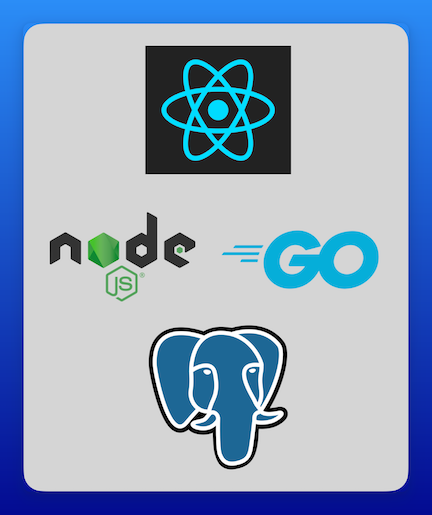
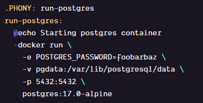
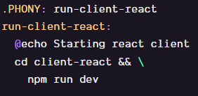

# Sample web application

## Minimal 3 tier web application
- **React frontend:** Uses react query to load data from the two apis and display the result
- **Node JS and Golang APIs:** Both have `/` and `/ping` endpoints. `/` queries the Database for the current time, and `/ping` returns `pong`
- **Postgres Database:** An empty PostgreSQL database with no tables or data. Used to show how to set up connectivity. The API applications execute `SELECT NOW() as now;` to determine the current time to return.

## Running the Application

The `Makefile` contains the commands to start each application.

### Postgres

Postgres is run in a container.

`make run-postgres` will start postgres in a container and publish port 5432 from the container to your localhost.

### api-node

To run the node api you will need to run `npm install` to install the dependencies. They are already present in the package.json file so you don't need to specify them, just run the command and you are good to go.

After installing the dependencies, `make run-api-node` will run the api in development mode with nodemon for restarting the app when you make source code changes.

### api-golang 

To run the golang api you will need to run `go mod download` to download and install the dependencies.

After installing the dependencies, `make run-api-golang` will build and run the api.

### client-react

Like `api-node`, you will first need to install the dependencies with `npm install`

After installing the dependencies, `make run-client-react` will use vite to run the react app in development mode.

## What is the goal of this project ?

A very `simple` and `straightforward` web app to `containerize`, you'll find in each directory a `Dockerfile` with explanations of each step.

The whole point of this repo is to containerize this app, include each image in a `Docker-compose` file and run the whole web app as `separate containers`.

It's truly a great project to follow along if you're new to `Docker` and it's key concepts.
